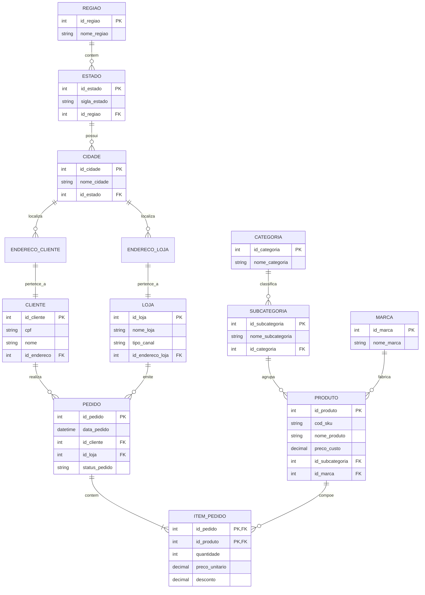

# Laboratório Prático - Aula 05: Modelagem Multidimensional
## Caso Corporativo: MegaRetail Omnichannel

---

### 1. O Colapso do ERP Transacional (3FN)
A **MegaRetail**, uma grande rede varejista brasileira com dezenas de lojas físicas e operação de e-commerce integrada, enfrentou um incidente crítico em sua infraestrutura de dados. Durante o fechamento trimestral, a Diretoria Comercial solicitou um relatório analítico aparentemente simples:

> *"Qual foi o faturamento total consolidado por Região Geográfica e Categoria de Produto nos últimos 3 anos?"*

O banco de dados operacional do ERP — modelado rigorosamente na **3ª Forma Normal (3FN)** para garantir integridade transacional — levou **42 minutos para processar a consulta**, executando **12 operações de `JOIN`** através de uma teia relacional altamente fragmentada.

Durante a execução da query, o consumo de CPU atingiu 100%, gerando esgotamento do *buffer pool* e travamento nos caixas (PDV) das lojas físicas, que ficaram impossibilitados de emitir cupons fiscais por quase meia hora.

---

### 2. A Arquitetura do ERP Legado (O Modelo que Causou o Problema)

Observe abaixo o Diagrama Entidade-Relacionamento (DER) do banco transacional OLTP em 3FN do ERP da MegaRetail. Note como os dados necessários para responder à pergunta da diretoria estão espalhados por diversas tabelas normalizadas:

---

### 3. O Desafio
A liderança da empresa concluiu que **sistemas OLTP normalizados não foram feitos para análises em massa**. Vocês foram contratados como Engenheiros e Arquitetos de Dados para projetar e implementar um **Data Mart Dimensional (Star Schema)** dedicado a Business Intelligence e Analytics.

Com base na **Metodologia de 4 Passos de Ralph Kimball**, sua equipe deve:

1. **Passo 1 (Processo de Negócio):** Identificar claramente o evento operacional a ser modelado.
2. **Passo 2 (Declaração da Granularidade):** Definir o nível de detalhe mais atômico de uma linha na tabela fato.
3. **Passo 3 (Identificação das Dimensões):** Mapear o contexto analítico (Tempo, Produto, Loja, Cliente), desnormalizando as hierarquias necessárias.
4. **Passo 4 (Identificação dos Fatos e Métricas):** Selecionar as medidas quantitativas aditivas e não-aditivas.
5. **Modelagem Star Schema:** Desenhar o Diagrama Dimensional em Mermaid.js utilizando *Surrogate Keys* inteiras.
6. **Implementação SQL DDL:** Escrever os scripts `CREATE TABLE` com integridade referencial e chaves substitutas.
7. **Consultas OLAP:** Escrever e demonstrar queries analíticas para responder à pergunta da diretoria (via *Slice & Dice*, *Roll-up* e *Drill-down*), provando a redução drástica no número de JOINs e no tempo de resposta.
