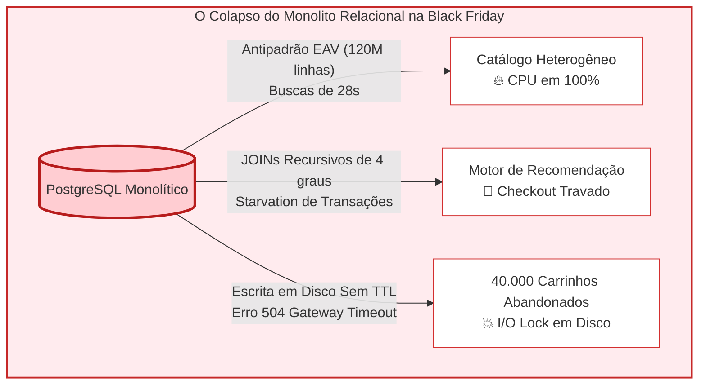
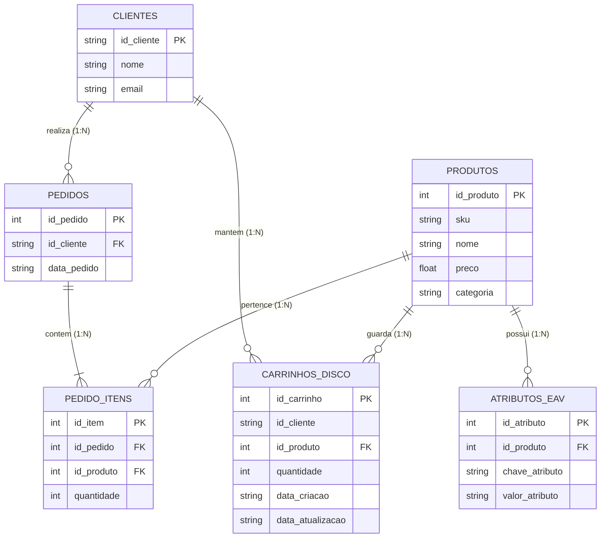
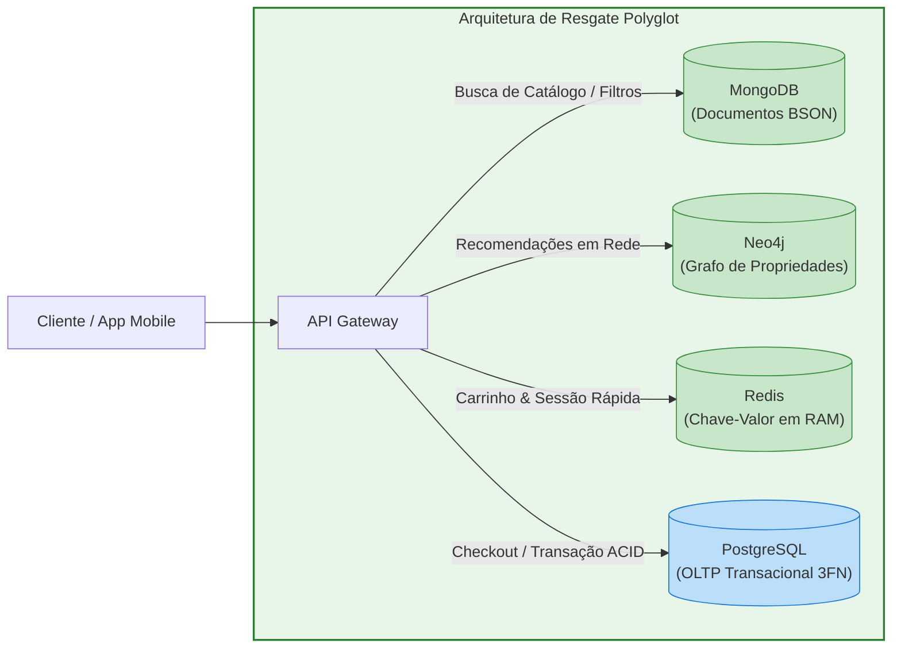

# Laboratório Prático Aula 06: Modelagem para Sistemas NoSQL e Persistência Poliglota

**FUCAPE Business School**  
**Curso:** Graduação em Ciência de Dados para Negócios  
**Disciplina:** Modelagem Informacional  
**Professor:** Prof. Dr. Wagner Perin  

---

## O Redesenho Polyglot da OmniMarketplace: Da Dor Relacional ao Resgate NoSQL

Nossa empresa fictívia, a **OmniMarketplace**, é uma das maiores plataformas de comércio eletrônico do país, conectando mais de 50.000 lojistas e comercializando 5 milhões de itens distintos — desde eletrônicos sofisticados e vestuário até autopeças e alimentos.

Durante a última Black Friday, a engenharia da empresa enfrentou uma catástrofe arquitetural que resultou em significativas perdas financeiras, gerada pela insistência em utilizar um **único banco de dados relacional monolítico (PostgreSQL)** para atender a cargas de trabalho estruturalmente incompatíveis com a 3ª Forma Normal (3FN).



### Inquiry-Based Learning
Neste laboratório, você não começará consumindo respostas prontas. Em vez disso, aplicaremos o método de **Conflito Cognitivo Guiado**:
1. **Fase 1 (Vivenciar a Dor):** Você instanciará o banco relacional problemático localmente e executará as consultas que levaram os servidores da OmniMarketplace ao colapso, respondendo a perguntas socráticas de projeção de escala.
2. **Fase 2 (A Descoberta da Solução):** Você experimentará como a **Persistência Poliglota (*Polyglot Persistence*)** distribui essas cargas de trabalho em bancos especializados (*Documentos*, *Grafos* e *Chave-Valor*), eliminando os gargalos algorítmicos.
3. **Fase 3 (Do Mock ao Mundo Real):** Você receberá o guia e a infraestrutura completa de containers e nuvem para orquestrar essas tecnologias em ambientes reais de produção.

---

## Fase 1: Vivenciando a Dor no Monolito Relacional

### 1.1 Diagrama Entidade-Relacionamento do Monolito Problemático
Analise a estrutura que foi desenhada no PostgreSQL da OmniMarketplace:



### 1.2 Roteiro de Execução Passo a Passo

Abra o seu terminal no diretório deste repositório e execute os comandos abaixo:

```bash
# Passo 1: Instanciar e popular o banco relacional problemático (SQLite local)
python3 gerar_banco_problematico.py

# Passo 2: Executar as consultas que evidenciam o sofrimento do RDBMS
sqlite3 omnimarketplace_monolito.db < consultas_dor_relacional.sql
```

> [!TIP]
> Se preferir uma interface visual, você pode abrir o arquivo `omnimarketplace_monolito.db` no **DBeaver**, no **VS Code SQLite Viewer** ou em qualquer cliente SQLite corporativo e executar as queries contidas em [`consultas_dor_relacional.sql`](file:///home/wagnerperin/fucape/disciplinas/modelagem-informacional/01_planos_de_aulas/repositorio_aula06/consultas_dor_relacional.sql).

---

### 1.3 O Diagnóstico das 3 Dores e Provocações Socráticas

Analise os resultados retornados no terminal para cada consulta e reflita criticamente antes de avançar para a solução:

#### 🔴 Dor 1: O Pesadelo do Catálogo Heterogêneo (Antipadrão EAV)
* **O Código:** Para encontrar uma Smart TV que seja simultaneamente Bivolt, tenha 4 portas HDMI e resolução 4K, foi necessário realizar **três auto-JOINs** na mesma tabela `atributos_eav` (`JOIN ... a_volt`, `JOIN ... a_hdmi`, `JOIN ... a_res`).
* **Provocações Socráticas:**
  1. *O que acontece com a quantidade de JOINs quando a interface da loja oferece 8 filtros simultâneos (marca, conectividade, polegadas, som, voltagem, HDR, frequência, sistema operacional)?*
  2. *Na nossa base sintética há apenas 8 produtos e a query rodou em frações de milissegundo. O que acontece com a CPU do banco quando a tabela `atributos_eav` possui **120 milhões de linhas** e 200.000 clientes disparam filtros simultâneos?*
  3. *Por que a equipe simplesmente não adicionou colunas `aro`, `tamanho_camiseta` e `portas_hdmi` diretamente na tabela `produtos`? Qual é o problema de ter 95% de campos `NULL` em um catálogo de 5 milhões de itens?

#### 🔴 Dor 2: O Travamento do Motor de Recomendação em Rede
* **O Código:** Para responder *"Quem comprou a TV de Lucas também comprou..."*, a consulta precisou de **4 auto-JOINs em cascata** entre `pedidos` e `pedido_itens`, combinados com uma subquery de exclusão (`NOT IN`) e agrupamento com contagem distinta.
* **Provocações Socráticas:**
  1. *Essa consulta cobriu apenas **1 grau de separação** (clientes que compraram o mesmo produto). O que aconteceria com a complexidade algorítmica e o plano de execução SQL se precisássemos expandir para 2 ou 3 graus ("amigos de amigos que compraram")?*
  2. *Durante a Black Friday, a tabela `pedidos` recebe milhares de novas gravações por segundo no checkout. O que acontece quando consultas pesadas de recomendação competem pelos mesmos blocos de dados de pedidos em tempo real? O que significa **Starvation** nesse contexto?*

#### 🔴 Dor 3: O Gargalo de I/O em Disco dos Carrinhos Efêmeros
* **O Código:** A tabela `carrinhos_disco` gravou todas as adições de produtos diretamente nas páginas de dados do disco rígido. Para expurgar os carrinhos com mais de 2 horas de abandono, foi disparado um `DELETE` em lote.
* **Provocações Socráticas:**
  1. *Mais de 90% dos carrinhos de um e-commerce são abandonados e nunca se transformam em vendas. Faz sentido obrigar o subsistema de armazenamento a gravar em disco permanente (WAL - Write-Ahead Logging) dados voláteis que durarão minutos?*
  2. *Em bancos relacionais corporativos (PostgreSQL/MySQL), o comando `DELETE` limpa o espaço em disco de forma instantânea? (Pesquise: "Dead Tuples", "PostgreSQL VACUUM", "Write Amplification").*
  3. *Quando o DBA executa um script de `DELETE` em centenas de milhares de linhas durante o pico de tráfego, que tipo de lock ocorre na tabela? Como isso causou os 40.000 erros de Gateway Timeout 504 no checkout?*

---

## Fase 2: A Arquitetura de Resgate — Persistência Poliglota com Mocks

A solução moderna para sistemas de alta escala não é tentar "forçar" todo tipo de dado dentro de um único motor relacional, mas sim adotar **Persistência Poliglota (*Polyglot Persistence*)**: usar o banco com a estrutura física de dados otimizada para o padrão de acesso de cada subsistema.



### 2.1 Resgate da Dor 1: MongoDB para Catálogo Heterogêneo
* **Conceito:** O MongoDB adota o paradigma *Schema-on-Read* e formato de documentos BSON (JSON binário). Cada documento carrega seus próprios atributos técnicos em objetos aninhados (*Embedded Documents*), sem a necessidade de tabelas intermediárias ou auto-JOINs.
* **Arquivos do Repositório:**
  - Inspecione a modelagem em [`catalogo_produtos.json`](file:///home/wagnerperin/fucape/disciplinas/modelagem-informacional/01_planos_de_aulas/repositorio_aula06/catalogo_produtos.json).
  - Execute o script de mock em Python:
    ```bash
    python3 script_mongodb.py
    ```
* **O Ganho Arquitetural:**
  - A consulta por resolução 4K (`especificacoes_tecnicas.resolucao = "3840 x 2160"`) ou aro 16 é feita com **Zero JOINs**.
  - Novos produtos com atributos inéditos podem ser cadastrados imediatamente sem alterar o schema do banco (*No Schema Migrations*).

### 2.2 Resgate da Dor 2: Neo4j para Recomendações Sociais
* **Conceito:** No modelo de Grafos de Propriedades do Neo4j, relacionamentos são cidadãos de primeira classe armazenados como ponteiros de memória físicos (**Index-Free Adjacency**). Navegar entre nós tem complexidade $O(1)$ por salto, independentemente do volume total de dados no banco.
* **Arquivos do Repositório:**
  - Inspecione o script Cypher em [`queries_grafo.cypher`](file:///home/wagnerperin/fucape/disciplinas/modelagem-informacional/01_planos_de_aulas/repositorio_aula06/queries_grafo.cypher).
* **O Ganho Arquitetural:**
  - Toda a complexidade de 4 auto-JOINs e subqueries do SQL relacional é substituída por uma declaração intuitiva de caminho:
    ```cypher
    MATCH (clienteAlvo:Cliente {id: 'u001'})-[:COMPROU]->(p:Produto)<-[:COMPROU]-(outro:Cliente)
    MATCH (outro)-[:COMPROU]->(recomendacao:Produto)
    WHERE NOT (clienteAlvo)-[:COMPROU]->(recomendacao)
    RETURN recomendacao.nome, count(outro) AS Forca
    ORDER BY Forca DESC;
    ```
  - As consultas de recomendação deixam de tocar nas tabelas de transações financeiras, eliminando o *starvation* do checkout.

### 2.3 Resgate da Dor 3: Redis para Carrinho Efêmero e Cache
* **Conceito:** O Redis armazena os dados inteiramente na memória RAM, oferecendo latência submilissegundo para leitura e escrita ($O(1)$). Ele possui expiração atômica nativa por **TTL (*Time-To-Live*)**, eliminando scripts de DELETE e desonerando o disco rígido.
* **Arquivos do Repositório:**
  - Inspecione e execute o script de mock em Python:
    ```bash
    python3 script_redis_carrinho.py
    ```
* **O Ganho Arquitetural:**
  - O carrinho de cada usuário é gravado como um `Hash` do Redis (`HSET cart:u001 "TV-4K-65" 1`).
  - O comando `EXPIRE cart:u001 7200` agenda a exclusão automática após 2 horas de inatividade sem gerar I/O de disco nem locks.
  - **Dimensionamento de Memória:** 200.000 carrinhos simultâneos ocupando 500 bytes consomem apenas **~100 MB de RAM**, provando que manter dados efêmeros na memória é infinitamente mais barato e veloz do que sobrecarregar o storage relacional.

---

## Fase 3: Do Mock para o Mundo Real (Desafios Práticos)

Agora que você compreendeu o princípio teórico e validou o funcionamento algorítmico via mocks, seu próximo passo como Cientista de Dados e Engenheiro de Dados é operar os motores NoSQL reais!

### 3.1 Subindo a Infraestrutura com Docker Compose

Disponibilizamos neste repositório o arquivo [`docker-compose.yml`](file:///home/wagnerperin/fucape/disciplinas/modelagem-informacional/01_planos_de_aulas/repositorio_aula06/docker-compose.yml), configurado para instanciar instâncias reais e oficiais dos três bancos:

```bash
# Subir os 3 bancos em background (se possuir o Docker instalado):
docker compose up -d

# Verificar se os containers estão saudáveis:
docker compose ps
```

| Serviço | Imagem | Portas Expostas | Credenciais Padrão | Finalidade |
| :--- | :--- | :--- | :--- | :--- |
| **MongoDB** | `mongo:latest` | `27017` | `admin` / `fucape_password123` | Catálogo de produtos JSON |
| **Neo4j** | `neo4j:latest` | `7474` (Web), `7687` (Bolt) | `neo4j` / `fucape_password123` | Browser de Grafos e Cypher |
| **Redis** | `redis:latest` | `6379` | Senha: `fucape_password123` | Cache e Carrinho em Memória RAM |

> [!NOTE]
> Você pode acessar o console visual do Neo4j diretamente pelo navegador em [http://localhost:7474](http://localhost:7474), autenticar com o usuário `neo4j` e executar as queries do arquivo [`queries_grafo.cypher`](file:///home/wagnerperin/fucape/disciplinas/modelagem-informacional/01_planos_de_aulas/repositorio_aula06/queries_grafo.cypher) visualizando os nós e arestas coloridos!

---

### 3.2 Alternativa em Nuvem Gratuita (Cloud Sandboxes)

Se você não tiver o Docker configurado no seu ambiente local ou preferir trabalhar em ambientes de nuvem gerenciados idênticos aos de produção corporativa, crie contas gratuitas nas plataformas oficiais:
1. **MongoDB Atlas:** Crie um cluster gratuito *M0 (Shared Free Tier)* em [mongodb.com/cloud/atlas](https://www.mongodb.com/cloud/atlas).
2. **Neo4j AuraDB:** Crie uma instância de grafo gratuita *AuraDB Free* em [neo4j.com/cloud/platform/aura-graph-database](https://neo4j.com/cloud/platform/aura-graph-database/).
3. **Redis Cloud:** Crie uma base em memória gratuita (30 MB) em [redis.io/try-free](https://redis.io/try-free/).

---

### 3.3 Desafios Propostos para as Próximas Aulas

Como preparação para o módulo de **Pipelines e Integração de Dados (Aula 07)**, resolva os seguintes desafios arquiteturais:

* [ ] **Desafio 1 (MongoDB Real com PyMongo):**  
  Adapte o script [`script_mongodb.py`](file:///home/wagnerperin/fucape/disciplinas/modelagem-informacional/01_planos_de_aulas/repositorio_aula06/script_mongodb.py) para utilizar a biblioteca oficial `pymongo`, conectando-se ao container ou ao MongoDB Atlas e criando um índice composto em `especificacoes_tecnicas.resolucao`.

* [ ] **Desafio 2 (Detecção de Fraudes em Grafo no Neo4j):**  
  Crie nós do tipo `(c:CartaoCredito)` e `(ip:EnderecoIP)` no Neo4j e elabore uma consulta Cypher que detecte múltiplos clientes diferentes utilizando o mesmo cartão de crédito em um intervalo de menos de 10 minutos (padrão de fraude em anel).

* [ ] **Desafio 3 (Rate Limiting com Redis):**  
  Utilizando comandos atômicos do Redis (`INCR` e `EXPIRE`), implemente um limitador de requisições que bloqueie IPs que façam mais de 30 chamadas por segundo na API de checkout da OmniMarketplace.

---

## Estrutura de Arquivos deste Repositório

| Arquivo | Descrição |
| :--- | :--- |
| [`monolito_problematico.sql`](file:///home/wagnerperin/fucape/disciplinas/modelagem-informacional/01_planos_de_aulas/repositorio_aula06/monolito_problematico.sql) | DDL e carga sintética do banco relacional problemático da OmniMarketplace. |
| [`gerar_banco_problematico.py`](file:///home/wagnerperin/fucape/disciplinas/modelagem-informacional/01_planos_de_aulas/repositorio_aula06/gerar_banco_problematico.py) | Script de criação do banco SQLite local com mensagens pedagógicas. |
| [`consultas_dor_relacional.sql`](file:///home/wagnerperin/fucape/disciplinas/modelagem-informacional/01_planos_de_aulas/repositorio_aula06/consultas_dor_relacional.sql) | As 3 consultas que comprovam as limitações do RDBMS com provocações socráticas. |
| [`catalogo_produtos.json`](file:///home/wagnerperin/fucape/disciplinas/modelagem-informacional/01_planos_de_aulas/repositorio_aula06/catalogo_produtos.json) | Modelagem de catálogo heterogêneo em formato de documentos JSON (MongoDB). |
| [`script_mongodb.py`](file:///home/wagnerperin/fucape/disciplinas/modelagem-informacional/01_planos_de_aulas/repositorio_aula06/script_mongodb.py) | Mock de banco orientado a documentos em Python (Schema-on-Read, Zero JOINs). |
| [`queries_grafo.cypher`](file:///home/wagnerperin/fucape/disciplinas/modelagem-informacional/01_planos_de_aulas/repositorio_aula06/queries_grafo.cypher) | Definição de nós, arestas e consulta Cypher de recomendação social no Neo4j. |
| [`script_redis_carrinho.py`](file:///home/wagnerperin/fucape/disciplinas/modelagem-informacional/01_planos_de_aulas/repositorio_aula06/script_redis_carrinho.py) | Mock de carrinho efêmero em Redis com TTL atômico e cálculo de consumo de RAM. |
| [`docker-compose.yml`](file:///home/wagnerperin/fucape/disciplinas/modelagem-informacional/01_planos_de_aulas/repositorio_aula06/docker-compose.yml) | Orquestração de containers dos 3 motores NoSQL oficiais (MongoDB, Neo4j, Redis). |
| [`Solucao_Laboratorio.md`](file:///home/wagnerperin/fucape/disciplinas/modelagem-informacional/01_planos_de_aulas/repositorio_aula06/Solucao_Laboratorio.md) | Gabarito detalhado com fundamentação técnica e guia socrático para o docente. |

---

> *"Não existe o banco de dados perfeito para todos os problemas. Existe a estrutura física correta para o padrão de acesso do seu negócio."*  
> — **Engenharia de Dados & Persistência Poliglota na FUCAPE Business School**
