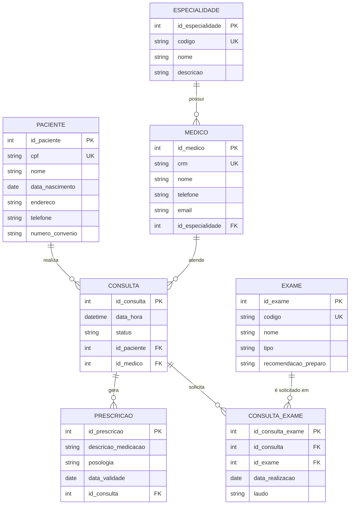

# Laboratório 1 - Aula 04: Modelagem Informacional

## 1. Identificação e Contexto
**Caso Corporativo:** HealthCare Connect (Rede Integrada de Clínicas Médicas e Diagnósticos)

A *HealthCare Connect* é uma rede privada que integra atendimento clínico presencial, serviços de diagnóstico por imagem e exames laboratoriais. Com o crescimento acelerado, a diretoria identificou a necessidade de unificar seus sistemas, criando uma base de dados centralizada para suportar as operações, garantir a segurança do paciente e viabilizar a auditoria médica.

Vocês, como Arquitetos de Dados Juniores, foram alocados neste projeto. A primeira missão é entender o domínio do negócio através do documento de "Minimundo" (requisitos elicitados) e projetar o Diagrama Entidade-Relacionamento (DER).

---

## 2. Narrativa do Minimundo

### 2.1. O Dia a Dia Operacional
A rotina da clínica gira em torno do atendimento ao paciente. Um paciente, ao chegar na recepção, é cadastrado com nome completo, CPF (único), data de nascimento, endereço, telefone de contato e um número de carteirinha do convênio (caso possua). 

O paciente realiza agendamentos de **Consultas**. Cada consulta é marcada para uma data e hora específicas, possui um *status* (agendada, confirmada, realizada, cancelada) e está vinculada a um **Médico**. 

Os médicos são identificados por seu CRM (único), nome, telefone e e-mail. Um médico atua em apenas uma **Especialidade** principal na clínica (ex: Cardiologia, Pediatria, Ortopedia). A especialidade possui um código, nome e uma breve descrição.

Durante a consulta, o médico avalia o paciente e registra informações clínicas. Ele pode gerar várias **Prescrições** (receituários). Uma prescrição não existe solta no sistema; ela pertence estritamente a uma consulta específica. Cada prescrição contém uma descrição das medicações, posologia e a data de validade da receita.

Além das prescrições, o médico pode solicitar **Exames**. Existem diversos tipos de exames cadastrados previamente no sistema (ex: Hemograma Completo, Raio-X de Tórax, Ressonância Magnética), cada um com um código único, nome, tipo (imagem, laboratório) e recomendações de preparo. Em uma mesma consulta, o médico pode solicitar vários exames diferentes. Ao mesmo tempo, um tipo de exame pode ser solicitado em inúmeras consultas. Quando um exame é solicitado em uma consulta, o sistema deve registrar a data em que o exame foi efetivamente realizado e os resultados ou laudo correspondente.

### 2.2. Entrevistas com Stakeholders

**Diretor Clínico (Dr. Ribeiro):**
> "Precisamos ter certeza de quem atendeu o paciente. Um paciente pode vir aqui várias vezes ao longo do ano, e precisamos de um histórico. Ou seja, um paciente tem muitas consultas, e cada consulta é de um paciente. Além disso, o CRM do médico é sagrado, nunca se repete."

**Coordenadora de Atendimento (Mariana):**
> "Na recepção, precisamos saber qual médico atende o quê. Como os contratos deles são restritos a uma única especialidade, um médico só pode estar vinculado a uma especialidade. Claro, a Cardiologia, por exemplo, tem vários médicos nossos trabalhando nela."

**Gerente de TI (Carlos):**
> "Prestem atenção nas prescrições médicas. Se por algum motivo (erro de sistema ou auditoria) nós deletarmos o registro de uma consulta, as prescrições vinculadas àquela consulta também devem sumir ou ser arquivadas. Uma receita sem consulta não faz sentido. Já os exames, eles existem num catálogo à parte. Uma consulta pode pedir vários exames, e um tipo de exame (ex: Glicemia) é pedido em várias consultas. Precisamos guardar a data em que o paciente foi lá furar o braço para fazer aquele exame específico."

---

## 3. Guia Prático de Tarefas para os Alunos

**Objetivo:** Transformar o texto acima em um Modelo Conceitual.

### Fase 1: Elicitação
1. Leia o Minimundo.
2. Destaque (ou liste) os **Substantivos** que representam potenciais Entidades (ex: Paciente).
3. Destaque os **Verbos** que indicam Relacionamentos (ex: Paciente *agenda* Consulta).

### Fase 2: Matriz de Cardinalidades e Regras de Negócio
Mapeie as regras extraídas do texto:
- Médico e Especialidade: (Qual a cardinalidade?)
- Paciente e Consulta: (Qual a cardinalidade?)
- Médico e Consulta: (Qual a cardinalidade?)
- Consulta e Prescrição: (Existe dependência existencial?)
- Consulta e Exame: (Qual a cardinalidade e o que acontece quando é N:M?)

### Fase 3: Definição de Chaves e Atributos
Para cada entidade identificada, defina:
- Chave Primária (PK): Identificador único interno.
- Chaves Únicas/Candidatas (UK): Atributos de negócio únicos (ex: CPF, CRM).
- Chaves Estrangeiras (FK): Para onde as chaves migram em relacionamentos 1:N?

### Fase 4: Construção do DER (Diagrama Entidade-Relacionamento)
Utilize a sintaxe do **Mermaid.js** para construir o diagrama de classe/ER. Considere a criação de entidades associativas quando necessário.

### Fase 5: Defesa Arquitetural
Responda às seguintes perguntas de negócio/banco de dados:
1. **Auditoria Médica:** Como você garante que o sistema não perca o histórico de qual médico solicitou determinado exame para o paciente?
2. **Restrições de Exclusão (CASCADE vs RESTRICT):** Segundo a TI, o que deve acontecer com as Prescrições se uma Consulta for removida? Qual comportamento relacional isso exige?
3. **Integridade de Dados:** Seria possível registrar uma Prescrição sem vinculá-la a uma Consulta? Justifique com base no texto.

---

## 4. Gabarito / Modelo de Referência Comentado

> [!WARNING]
> Consulte esta seção apenas após tentar resolver o laboratório por conta própria!

### Matriz de Respostas

**Fases 1, 2 e 3:**
- **Especialidade (1) - (N) Médico:** Uma especialidade possui vários médicos, mas um médico tem apenas uma especialidade. A PK de Especialidade (ex: id_especialidade) migra como FK para Médico.
- **Paciente (1) - (N) Consulta:** Um paciente realiza várias consultas, uma consulta pertence a um único paciente.
- **Médico (1) - (N) Consulta:** Um médico realiza várias consultas.
- **Consulta (1) - (N) Prescrição:** Entidade Fraca! Uma prescrição não existe sem consulta. Dependência de existência e identificação. CASCADE on delete.
- **Consulta (N) - (M) Exame:** Relacionamento muitos-para-muitos. Gera uma entidade/tabela associativa (ex: `Consulta_Exame`), que conterá as FKs de Consulta e Exame, além dos atributos de relacionamento citados (Data de Realização e Laudo/Resultado).

**Fase 5 - Respostas:**
1. Através do relacionamento entre `Consulta` e `Exame` na tabela associativa `Consulta_Exame`. Como a `Consulta` possui as FKs tanto de `Paciente` quanto de `Médico`, sabemos exatamente quem atendeu quem na hora de pedir o exame.
2. A exclusão de uma consulta deve gerar a exclusão em cascata (`ON DELETE CASCADE`) das suas prescrições (entidade fraca), garantindo a consistência apontada pelo Gerente de TI.
3. Não. O gerente de TI deixa claro que uma prescrição sem consulta não faz sentido (Entidade Fraca). O modelo deve impor restrição `NOT NULL` na FK de consulta dentro de prescrição.

### Fase 4: Diagrama Mermaid (Gabarito)

