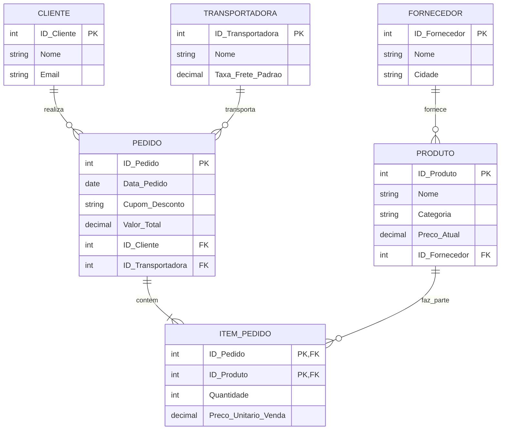

# Laboratório 2: Modelagem Conceitual e Normalização (1FN a 3FN)

## Caso Corporativo: GlobalTrade Marketplace (Startup de E-commerce)

A **GlobalTrade** é uma startup de e-commerce que cresceu muito rápido. Inicialmente, para simplificar e acelerar o desenvolvimento, a equipe de engenharia decidiu armazenar todas as informações de vendas em uma única "Planilha Universal Desnormalizada" ou tabela no banco de dados. 

Com o tempo, essa abordagem gerou diversos problemas de integridade de dados e dificultou a extração de relatórios analíticos, o que levou a equipe a um diagnóstico claro: o banco de dados precisava urgentemente de um processo de **Normalização**.

### A Planilha Universal Desnormalizada

A estrutura original contém as seguintes 14 colunas:
1. `ID_Pedido`
2. `Data_Pedido`
3. `Cliente_Nome`
4. `Cliente_Email`
5. `Produtos_Comprados` (ID e Nome) - *Pode conter vários produtos separados por vírgula*
6. `Categorias_Produtos` - *Separadas por vírgula*
7. `Quantidades` - *Separadas por vírgula*
8. `Precos_Unitarios` - *Separados por vírgula*
9. `Fornecedor_Nome`
10. `Fornecedor_Cidade`
11. `Transportadora_Nome`
12. `Taxa_Frete`
13. `Cupom_Desconto`
14. `Valor_Total`

---

## Roteiro do Laboratório

### Fase 1: Análise e Diagnóstico Empírico
Analise a estrutura atual e identifique exemplos práticos das três anomalias clássicas:
* **Anomalia de Inserção**: O que acontece se tentarmos cadastrar um novo Fornecedor ou Produto sem que uma venda (Pedido) tenha sido realizada?
* **Anomalia de Atualização**: Se o fornecedor mudar de cidade, o que precisa ser feito? Quais os riscos de inconsistência?
* **Anomalia de Exclusão**: Se um pedido for cancelado e apagado, quais informações importantes e independentes podem ser perdidas?

### Fase 2: Aplicação da 1FN (Primeira Forma Normal)
* **Regra**: Cada atributo deve ser atômico (indivisível) e não podem existir grupos repetitivos (campos multivalorados).
* **Ação**: Identifique os campos multivalorados (`Produtos_Comprados`, `Categorias_Produtos`, `Quantidades`, `Precos_Unitarios`) e reestruture os dados. A chave primária passará a ser composta, por exemplo: (`ID_Pedido`, `ID_Produto`).

### Fase 3: Aplicação da 2FN (Segunda Forma Normal)
* **Regra**: A tabela deve estar na 1FN e não podem existir dependências funcionais parciais (atributos não-chave dependendo de apenas uma parte da chave primária composta).
* **Ação**: Com a chave composta (`ID_Pedido`, `ID_Produto`), identifique o que depende apenas de `ID_Pedido` (como Data, Cliente, Frete) e o que depende apenas de `ID_Produto` (como Nome do Produto, Categoria, Preço Unitário Original). Crie tabelas separadas para Pedido e Produto, mantendo a tabela associativa (Itens do Pedido) apenas com as quantidades e preços praticados na venda.

### Fase 4: Aplicação da 3FN (Terceira Forma Normal)
* **Regra**: A tabela deve estar na 2FN e não podem existir dependências transitivas (atributos não-chave dependendo de outros atributos não-chave).
* **Ação**: Olhando para a tabela de Pedidos, note que `Cliente_Email` depende de `Cliente_Nome` (ou ID do Cliente), `Taxa_Frete` pode depender da `Transportadora_Nome`. Na tabela de Produtos, as informações do fornecedor (`Fornecedor_Cidade`) dependem do `Fornecedor_Nome` (ou ID do Fornecedor). Isole as entidades: Cliente, Fornecedor e Transportadora em suas próprias tabelas.

### Fase 5: Implementação em SQL DDL
Escreva os scripts de criação das tabelas finais normalizadas, garantindo integridade referencial com:
* `PRIMARY KEY`
* `FOREIGN KEY`
* `CHECK` (ex: quantidade > 0)
* `UNIQUE` (ex: email do cliente)
* `ON DELETE CASCADE` ou `RESTRICT`

### Fase 6: Carga DML e VIEW Analítica
* Insira dados de exemplo (`INSERT`).
* Crie uma `VIEW` chamada `VW_Resumo_Vendas` que consolide os dados reconstruindo a visão original (com `JOIN`s), fornecendo ao time de BI os dados: `ID_Pedido`, `Data_Pedido`, `Cliente_Nome`, `Nome_Produto`, `Quantidade`, `Valor_Total_Item`, `Transportadora_Nome`.

---

## Gabarito Oficial Comentado

### DER Final (Mermaid.js)



### Scripts SQL (DDL e DML)

```sql
-- DDL
CREATE TABLE Clientes (
    ID_Cliente INT PRIMARY KEY,
    Nome VARCHAR(100) NOT NULL,
    Email VARCHAR(100) UNIQUE NOT NULL
);

CREATE TABLE Transportadoras (
    ID_Transportadora INT PRIMARY KEY,
    Nome VARCHAR(100) NOT NULL,
    Taxa_Frete_Padrao DECIMAL(10, 2) NOT NULL
);

CREATE TABLE Fornecedores (
    ID_Fornecedor INT PRIMARY KEY,
    Nome VARCHAR(100) NOT NULL,
    Cidade VARCHAR(100) NOT NULL
);

CREATE TABLE Produtos (
    ID_Produto INT PRIMARY KEY,
    Nome VARCHAR(100) NOT NULL,
    Categoria VARCHAR(50) NOT NULL,
    Preco_Atual DECIMAL(10, 2) NOT NULL,
    ID_Fornecedor INT,
    FOREIGN KEY (ID_Fornecedor) REFERENCES Fornecedores(ID_Fornecedor)
);

CREATE TABLE Pedidos (
    ID_Pedido INT PRIMARY KEY,
    Data_Pedido DATE NOT NULL,
    Cupom_Desconto VARCHAR(50),
    Valor_Total DECIMAL(12, 2),
    ID_Cliente INT,
    ID_Transportadora INT,
    FOREIGN KEY (ID_Cliente) REFERENCES Clientes(ID_Cliente),
    FOREIGN KEY (ID_Transportadora) REFERENCES Transportadoras(ID_Transportadora)
);

CREATE TABLE Itens_Pedido (
    ID_Pedido INT,
    ID_Produto INT,
    Quantidade INT NOT NULL CHECK (Quantidade > 0),
    Preco_Unitario_Venda DECIMAL(10, 2) NOT NULL,
    PRIMARY KEY (ID_Pedido, ID_Produto),
    FOREIGN KEY (ID_Pedido) REFERENCES Pedidos(ID_Pedido) ON DELETE CASCADE,
    FOREIGN KEY (ID_Produto) REFERENCES Produtos(ID_Produto)
);

-- DML
INSERT INTO Clientes VALUES (1, 'Ana Silva', 'ana@email.com');
INSERT INTO Transportadoras VALUES (1, 'TransExpress', 50.00);
INSERT INTO Fornecedores VALUES (1, 'TechCorp', 'São Paulo');
INSERT INTO Produtos VALUES (101, 'Notebook Pro', 'Eletrônicos', 5500.00, 1);
INSERT INTO Pedidos VALUES (1001, '2023-10-01', 'BEMVINDO10', 5550.00, 1, 1);
INSERT INTO Itens_Pedido VALUES (1001, 101, 1, 5500.00);

-- VIEW Analítica
CREATE VIEW VW_Resumo_Vendas AS
SELECT 
    p.ID_Pedido,
    p.Data_Pedido,
    c.Nome AS Cliente_Nome,
    pr.Nome AS Nome_Produto,
    i.Quantidade,
    i.Preco_Unitario_Venda,
    (i.Quantidade * i.Preco_Unitario_Venda) AS Valor_Total_Item,
    t.Nome AS Transportadora_Nome
FROM Pedidos p
JOIN Clientes c ON p.ID_Cliente = c.ID_Cliente
JOIN Itens_Pedido i ON p.ID_Pedido = i.ID_Pedido
JOIN Produtos pr ON i.ID_Produto = pr.ID_Produto
JOIN Transportadoras t ON p.ID_Transportadora = t.ID_Transportadora;
```
